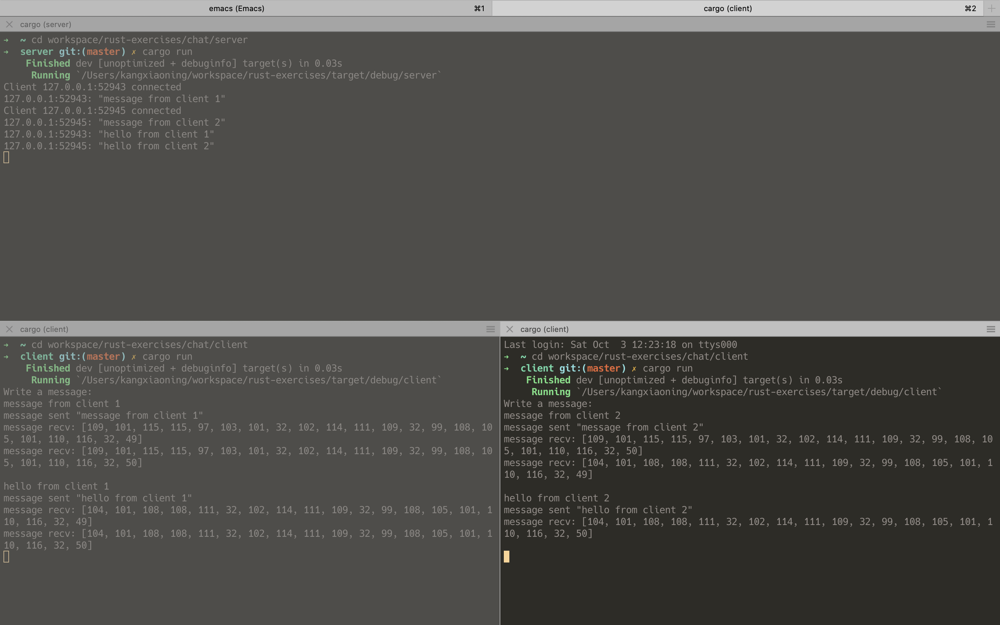

# chat

This is a client/server chat project, you can sent message from client to server.

## start server

```
➜  ~ cd workspace/rust-exercises/chat/server
➜  server git:(master) ✗ cargo run
    Finished dev [unoptimized + debuginfo] target(s) in 0.03s
     Running `/Users/kangxiaoning/workspace/rust-exercises/target/debug/server`
Client 127.0.0.1:52943 connected
127.0.0.1:52943: "message from client 1"
Client 127.0.0.1:52945 connected
127.0.0.1:52945: "message from client 2"
127.0.0.1:52943: "hello from client 1"
127.0.0.1:52945: "hello from client 2"


```

## start client

```
# client 1

➜  ~ cd workspace/rust-exercises/chat/client
➜  client git:(master) ✗ cargo run
    Finished dev [unoptimized + debuginfo] target(s) in 0.03s
     Running `/Users/kangxiaoning/workspace/rust-exercises/target/debug/client`
Write a message:
message from client 1
message sent "message from client 1"
message recv: [109, 101, 115, 115, 97, 103, 101, 32, 102, 114, 111, 109, 32, 99, 108, 105, 101, 110, 116, 32, 49]
message recv: [109, 101, 115, 115, 97, 103, 101, 32, 102, 114, 111, 109, 32, 99, 108, 105, 101, 110, 116, 32, 50]

hello from client 1
message sent "hello from client 1"
message recv: [104, 101, 108, 108, 111, 32, 102, 114, 111, 109, 32, 99, 108, 105, 101, 110, 116, 32, 49]
message recv: [104, 101, 108, 108, 111, 32, 102, 114, 111, 109, 32, 99, 108, 105, 101, 110, 116, 32, 50]


# client 2

➜  ~ cd workspace/rust-exercises/chat/client
➜  client git:(master) ✗ cargo run
    Finished dev [unoptimized + debuginfo] target(s) in 0.03s
     Running `/Users/kangxiaoning/workspace/rust-exercises/target/debug/client`
Write a message:
message from client 2
message sent "message from client 2"
message recv: [109, 101, 115, 115, 97, 103, 101, 32, 102, 114, 111, 109, 32, 99, 108, 105, 101, 110, 116, 32, 50]
message recv: [104, 101, 108, 108, 111, 32, 102, 114, 111, 109, 32, 99, 108, 105, 101, 110, 116, 32, 49]

hello from client 2
message sent "hello from client 2"
message recv: [104, 101, 108, 108, 111, 32, 102, 114, 111, 109, 32, 99, 108, 105, 101, 110, 116, 32, 50]


```


