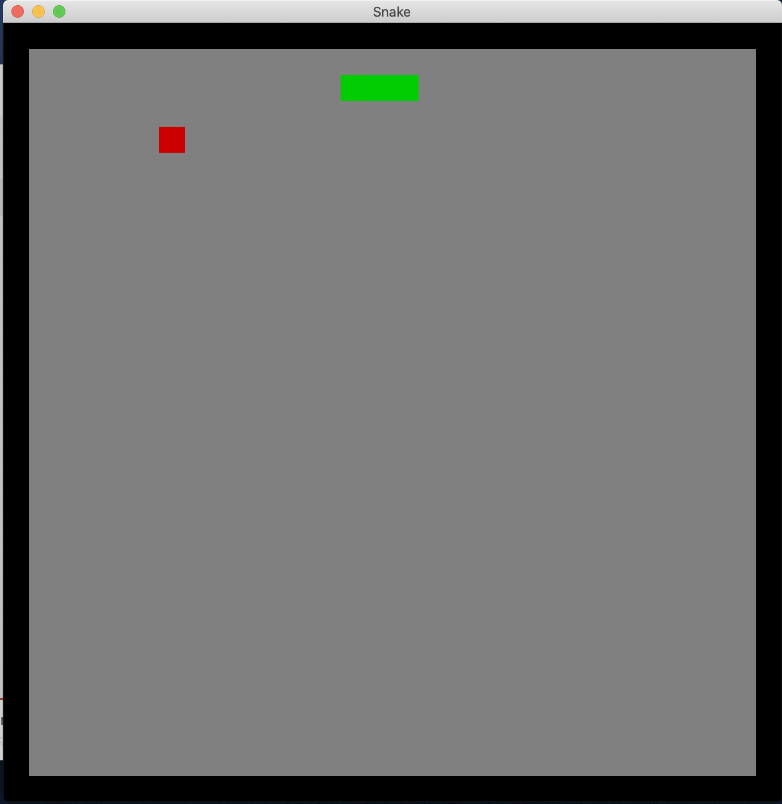

# snake game

```
➜  rust-exercises git:(master) cd snake
➜  snake git:(master)
➜  snake git:(master) cargo run
    Finished dev [unoptimized + debuginfo] target(s) in 0.38s
     Running `/Users/kangxiaoning/workspace/rust-exercises/target/debug/snake`
➜  snake git:(master)

```


